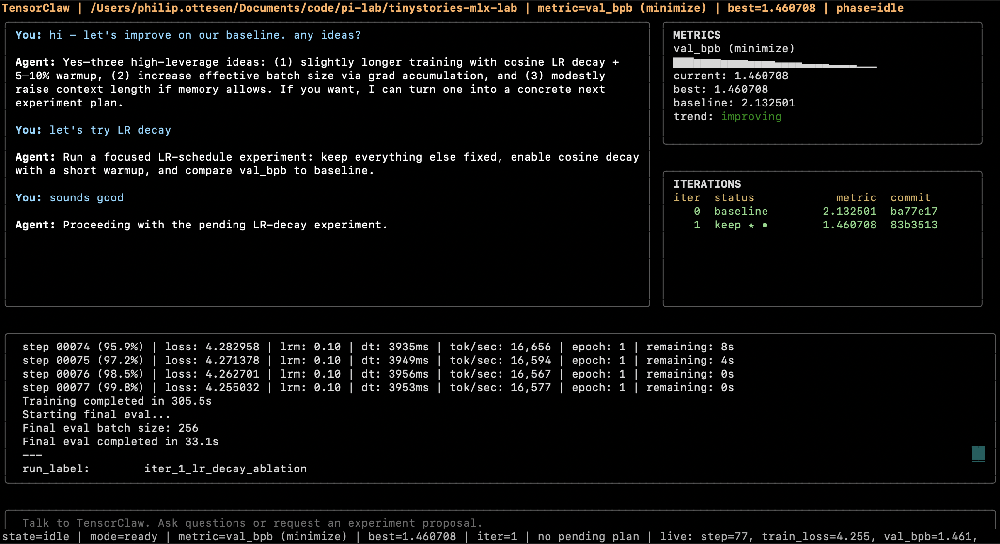

# TensorClaw

🦞🧪 TensorClaw is an agent-first ML research harness on top of [`pi`](https://github.com/badlogic/pi-mono), inspired by [autoresearch](https://github.com/karpathy/autoresearch).



## Install

```bash
pip install -e .
```

Requires:
- Python 3.10+
- `pi` on your `PATH` (`brew install pi-coding-agent`)
- `OPENAI_API_KEY` or `ANTHROPIC_API_KEY`

## Usage

```bash
tensorclaw [--dry-run]
```

Run from the target repo root.

## How It Works

TensorClaw enforces a metric-gated loop:

1. Chat with the agent.
2. Agent proposes one experiment plan.
3. You approve (`Y`) or reject (`N`).
4. Harness runs the experiment and parses objective metrics.
5. Harness keeps improvements, reverts regressions/crashes, and records the iteration.

## Dashboard

- Chat pane: streamed user/agent conversation + pending proposal card
- Metrics pane: objective sparkline, live monitor, run context, and `pi` token usage
- Iterations pane: baseline + keep/discard/crash history with best/latest markers
- Output pane: streamed setup/apply/experiment output
- Status bar: phase, metric snapshot, and total `pi` tokens

## Commands

| Command | Description |
|---|---|
| `Enter` (with text) | Send a chat message |
| `Y` | Approve pending proposal and start run |
| `N` | Reject pending proposal |
| `/status` | Print current state summary |
| `/reset` | Clear local TensorClaw history in `.tensorclaw/` |
| `/help` | Show command help |

## Data

TensorClaw stores run state under `.tensorclaw/` in the target project:

```text
.tensorclaw/
  results.tsv         # iteration ledger
  journal.md          # readable run journal
  metrics.jsonl       # live metric samples
  memory.jsonl        # retrieved memory for future prompts
  logs/               # run/apply logs
  instructions/       # saved prompts/instructions
  session.jsonl       # chat + pending plan state
```

## TinyStories

We use the [TinyStories dataset](https://huggingface.co/datasets/karpathy/tinystories-gpt4-clean). See [autoresearch](https://github.com/karpathy/autoresearch/blob/master/README.md#platform-support) for more info.

For a demo on Apple Silicon, run TensorClaw from your [`autoresearch-mlx`](https://github.com/trevin-creator/autoresearch-mlx) project root:

```bash
tensorclaw
```

## License

MIT
